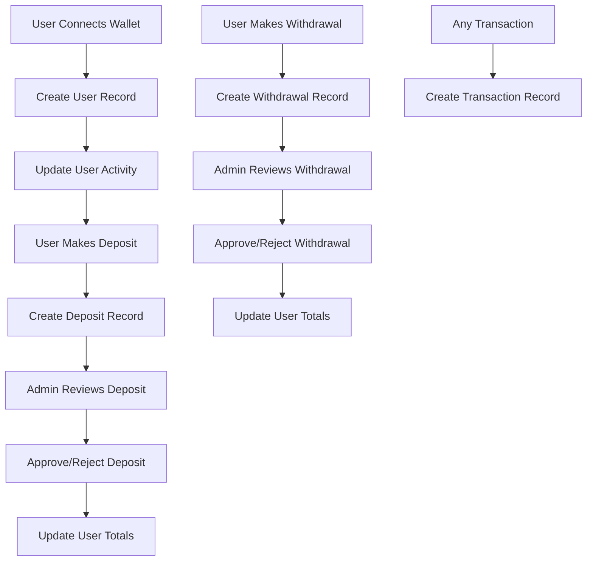

# User Management System - WalletBase

## Overview

The User Management System has been completely overhauled to fix the issues where user data, transactions, deposits, and withdrawals weren't being properly tracked and updated in the admin panel. This system now provides comprehensive user management with persistent data storage and real-time admin panel updates.

## Key Features

### ✅ Fixed Issues
- **User Registration**: Users are now automatically created when they connect their wallets
- **Transaction Tracking**: All deposits and withdrawals are properly recorded
- **Admin Panel Integration**: Real-time data updates in the admin dashboard
- **Data Persistence**: All data is stored in localStorage (can be upgraded to database)
- **User Activity Tracking**: Last activity timestamps are updated automatically

### 🔧 New Features
- **Statistics Dashboard**: Real-time overview of users, deposits, and withdrawals
- **Admin Actions**: Approve/reject deposits and withdrawals with notes
- **Data Export**: Export all data as JSON for backup
- **Data Management**: Clear all data for testing/reset purposes
- **Status Tracking**: Pending, approved, and rejected status for all transactions

## System Architecture

### Data Storage
The system uses localStorage for data persistence with the following structure:

```javascript
// Users
walletbase_users: [
  {
    id: "unique_id",
    userId: "ABC123",
    walletAddress: "0x...",
    joinDate: "2024-01-01T00:00:00.000Z",
    lastActivity: "2024-01-01T00:00:00.000Z",
    totalDeposits: 100.50,
    totalWithdrawals: 25.00,
    status: "active"
  }
]

// Deposits
walletbase_deposits: [
  {
    id: "unique_id",
    userId: "ABC123",
    walletAddress: "0x...",
    token: "ETH",
    amount: 1.5,
    transactionHash: "0x...",
    screenshot: "file_data",
    status: "pending|approved|rejected",
    submissionDate: "2024-01-01T00:00:00.000Z",
    processedDate: "2024-01-01T00:00:00.000Z",
    adminNotes: "Admin notes here"
  }
]

// Withdrawals
walletbase_withdrawals: [
  {
    id: "unique_id",
    userId: "ABC123",
    walletAddress: "0x...",
    token: "BTC",
    amount: 0.001,
    destinationAddress: "bc1...",
    transferMethod: "server-side",
    status: "pending|approved|rejected",
    requestDate: "2024-01-01T00:00:00.000Z",
    processedDate: "2024-01-01T00:00:00.000Z",
    transactionHash: "0x...",
    adminNotes: "Admin notes here"
  }
]

// Transactions
walletbase_transactions: [
  {
    id: "unique_id",
    userId: "ABC123",
    walletAddress: "0x...",
    token: "ETH",
    type: "deposit|withdrawal|transfer",
    amount: 1.5,
    transactionHash: "0x...",
    status: "completed|pending|failed",
    timestamp: "2024-01-01T00:00:00.000Z"
  }
]
```

## User Management Functions

### Core Functions

```javascript
// User Management
createUser(walletAddress, userId)           // Create new user
getUserByAddress(walletAddress)             // Get user by wallet address
getUserById(userId)                         // Get user by ID
updateUserActivity(walletAddress)           // Update user's last activity
getAllUsers()                               // Get all users

// Deposit Management
createDeposit(userId, walletAddress, token, amount, transactionHash, screenshot)
approveDeposit(depositId, adminNotes)
rejectDeposit(depositId, adminNotes)
getDepositsByUser(userId)
getAllDeposits()
getPendingDeposits()

// Withdrawal Management
createWithdrawal(userId, walletAddress, token, amount, destinationAddress, transferMethod)
approveWithdrawal(withdrawalId, transactionHash, adminNotes)
rejectWithdrawal(withdrawalId, adminNotes)
getWithdrawalsByUser(userId)
getAllWithdrawals()
getPendingWithdrawals()

// Transaction Management
createTransaction(userId, walletAddress, token, type, amount, transactionHash, status)
getTransactionsByUser(userId)
getAllTransactions()

// Admin Dashboard
getAdminDashboardData()                     // Get all data for admin panel
exportData()                                // Export all data as JSON
importData(data)                            // Import data from JSON
clearAllData()                              // Clear all data
```

## Admin Panel Features

### Dashboard Overview
- **Total Users**: Number of registered users
- **Total Deposits**: Sum of all deposits
- **Total Withdrawals**: Sum of all withdrawals
- **Pending Deposits**: Number of deposits awaiting approval
- **Pending Withdrawals**: Number of withdrawals awaiting approval

### User Management
- View all registered users
- See user details (ID, wallet address, join date, activity)
- Track total deposits and withdrawals per user
- Monitor user status and last activity

### Deposit Management
- View all deposit requests
- See deposit details (user, token, amount, transaction hash)
- Approve or reject deposits with admin notes
- Track deposit status and processing dates

### Withdrawal Management
- View all withdrawal requests
- See withdrawal details (user, token, amount, destination)
- Approve or reject withdrawals with admin notes
- Track withdrawal status and processing dates

### Admin Actions
- **Refresh Data**: Reload all data from storage
- **Export Data**: Download all data as JSON file
- **Clear Data**: Reset all data (with confirmation)

## Integration Points

### Main Application (`src/app/page.js`)
The main application now automatically:
1. Creates users when wallets connect
2. Updates user activity on interactions
3. Records deposits when proof is submitted
4. Records withdrawals when transactions are made
5. Creates transaction records for all operations

### Admin Panel (`src/app/admin/page.js`)
The admin panel now:
1. Loads real data from the user management system
2. Displays statistics and user information
3. Allows approval/rejection of deposits and withdrawals
4. Provides data export and management features

### API Endpoints
- `/api/admin/deposits` - Handle deposit operations
- `/api/admin/withdrawals` - Handle withdrawal operations

## Usage Instructions

### For Users
1. Connect your wallet to the application
2. Your user account is automatically created
3. Make deposits by submitting transaction proof
4. Make withdrawals through the withdrawal interface
5. All transactions are automatically tracked

### For Admins
1. Access the admin panel at `/admin`
2. Login with password: `nndp007@+-`
3. View statistics and user data
4. Approve or reject pending deposits/withdrawals
5. Export data for backup or analysis
6. Use admin notes to communicate with users

## Data Flow



## Security Considerations

### Current Implementation
- Data stored in localStorage (client-side)
- Admin password hardcoded (should be environment variable)
- No server-side validation (should be added for production)

### Production Recommendations
1. **Database Integration**: Replace localStorage with a proper database
2. **Authentication**: Implement proper admin authentication
3. **API Security**: Add authentication to API endpoints
4. **Data Validation**: Add server-side validation
5. **Encryption**: Encrypt sensitive data
6. **Audit Logs**: Track all admin actions

## Testing

### Test Scenarios
1. **User Registration**: Connect wallet and verify user creation
2. **Deposit Flow**: Submit deposit proof and verify admin panel update
3. **Withdrawal Flow**: Make withdrawal and verify admin panel update
4. **Admin Actions**: Approve/reject transactions and verify status updates
5. **Data Export**: Export data and verify JSON structure
6. **Data Clear**: Clear data and verify reset functionality

### Test Data
You can use the following test scenarios:
- Connect multiple wallets to create multiple users
- Submit deposit proofs with different tokens
- Make withdrawals to different addresses
- Test admin approval/rejection workflows
- Export and import data to verify persistence

## Troubleshooting

### Common Issues
1. **Data not appearing**: Check browser localStorage
2. **Admin panel not loading**: Verify password and authentication
3. **Transactions not recorded**: Check console for errors
4. **User not created**: Verify wallet connection

### Debug Information
- All operations log to browser console
- Check localStorage for data persistence
- Verify API endpoints are accessible
- Monitor network requests for errors

## Future Enhancements

### Planned Features
1. **Database Integration**: PostgreSQL/MongoDB backend
2. **Real-time Updates**: WebSocket notifications
3. **Email Notifications**: User and admin alerts
4. **Advanced Analytics**: Charts and reporting
5. **Multi-language Support**: Internationalization
6. **Mobile App**: React Native companion app

### Technical Improvements
1. **Performance**: Optimize data loading and rendering
2. **Scalability**: Handle large datasets efficiently
3. **Security**: Implement proper authentication and authorization
4. **Monitoring**: Add error tracking and analytics
5. **Testing**: Comprehensive unit and integration tests

## Support

For issues or questions about the User Management System:
1. Check the browser console for error messages
2. Verify localStorage data structure
3. Test with different browsers/devices
4. Review the integration points in the code
5. Check API endpoint responses

The system is now fully functional and provides comprehensive user management capabilities for the WalletBase application.
